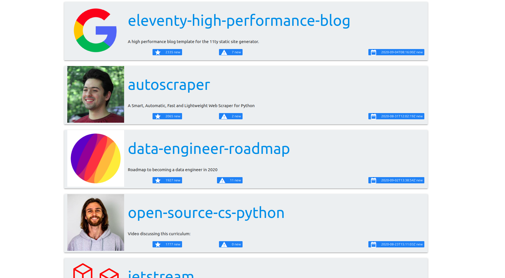

# Front End Coding Challenge

## Idea of the App

The task was to implement a small webapp that will list the most starred Github repos that were created in the last 30 days. by fetching the sorted JSON data directly from the Github API (Github API explained down below) and using pagination to implement infinite scroll.


## Features

- [x] As a User I should be able to list the most starred Github repos that were created in the last 30 days.
- [x] As a User I should see the results as a list. One repository per row.
- [x] As a User I should be able to see for each repo/row the following details :
    - Repository name
    - Repository description
    - Number of stars for the repo.
    - Number of issues for the repo.
    - Username and avatar of the owner.
- [x] As a User I should be able to keep scrolling and new results should appear (pagination).


## How to get the data from Github

To get the most starred Github repos created in the last 30 days (relative to 2017-11-22), you'll need to call the following endpoint :
`https://api.github.com/search/repositories?q=created:>2017-10-22&sort=stars&order=desc`
The JSON data from Github will be paginated (you'll receive around 100 repos per JSON page).
To get the 2nd page, you add `&page=2` to the end of your API request :
`https://api.github.com/search/repositories?q=created:>2017-10-22&sort=stars&order=desc&page=2`
To get the 3rd page, you add `&page=3` ... etc
You can read more about the Github API over [here](https://developer.github.com/v3/search/#search-repositories
).


## Mock up 


Here's what each element represents :


## Screenshot 
The final result of the project looks like : 

## Technologies Used in Project

- Reactjs 
- Materialize CSS 
- Moment.js
- Axios
- The Github API


## Setup
To setup the project you have to : 

```
git clone https://github.com/souhaildouqchi/frontendcodingchallenge.git

cd frontendcodingchallenge

npm install
```


## Running the app

To get the app up and running use :

```
npm start
```


The project will be available at :  **http://localhost:3000 to view it in the browser.**
